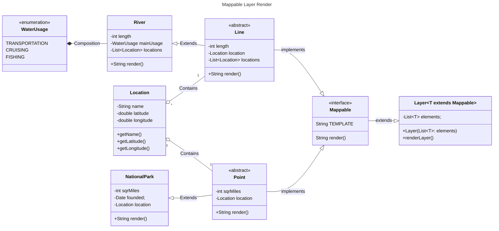

* A small project to mess around with Java generics.
  * Simply outputs a rendered string of a Mappable interface implementation
* Also a change to play around with mermaid.js

```mermaid
---
title: Mappable Layer Render
---
classDiagram
    direction RL
    class Layer~T extends Mappable~{
    -List~T~ elements;
    +Layer(List~T~: elements)
    +renderLayer()
    }
    Layer <|-- Mappable : extends
    class Mappable {
    <<interface>>
    String TEMPLATE
    String render()
    }
    class Line {
        <<abstract>>
        -int length
        -Location location
        -List~Location~ locations
        +String render()
    }
    
    class River{
        -int length
        -WaterUsage mainUsage
        -List~Location~ locations
        +String render()
    }
    River --* WaterUsage :Composition
    Line --|> River :Extends
    Mappable <|-- Line: implements
    Line "1"--o"*" Location: Contains
    
    class Point {
        <<abstract>>
        -int sqrMiles
        -Location location
        +String render()
    }
    
    class NationalPark {
        -int sqrMiles
        -Date founded;
        -Location location
        +String render()
    }
    Point --|> NationalPark:Extends
    
    Mappable <| -- Point :implements
    Point "1"--o"1"Location : Contains
    
    class Location{
        -String name
        -double latitude
        -double longitude
        +getName()
        +getLatitude()
        +getLongitude()
    }
    
    class WaterUsage{
        <<enumeration>>
        TRANSPORTATION
        CRUISING
        FISHING
    }
```